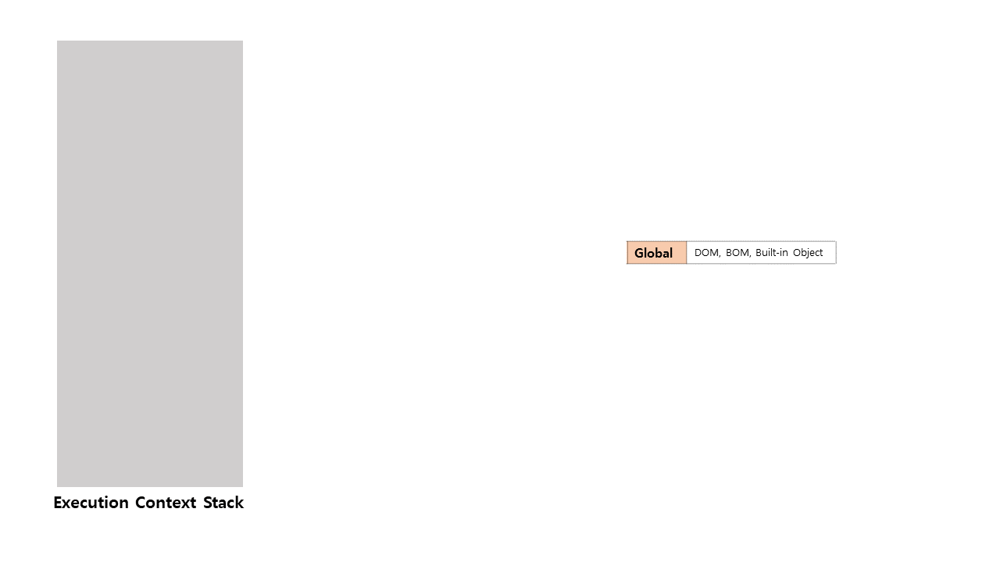
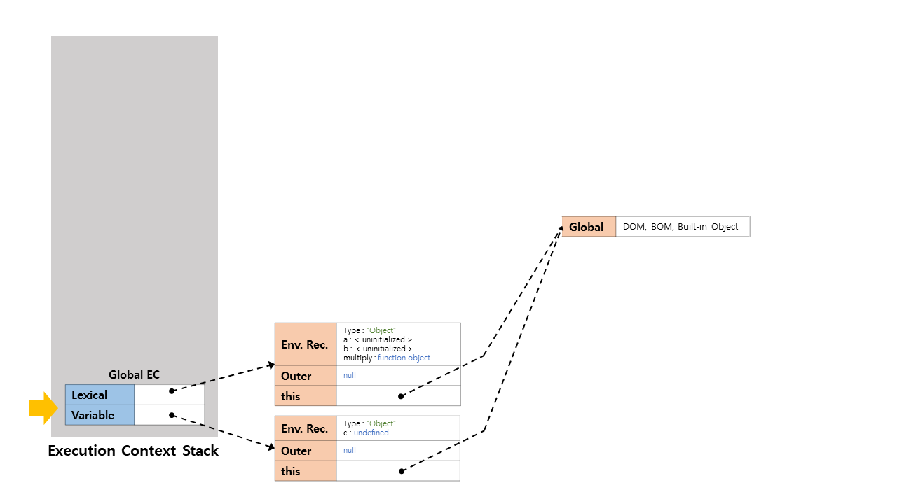
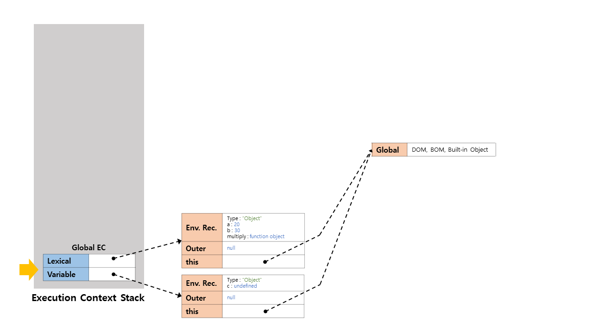
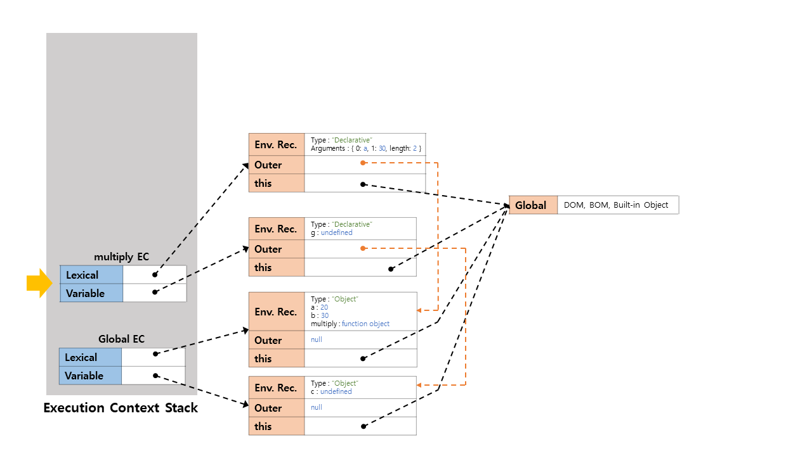

# 실행 컨텍스트
실행 컨텍스트(Execution Context, EC)란, 실행할 코드에 제공할 환경 정보들을 모아놓은 객체를 의미한다. `ECMAScript` 스펙에선 실행 컨텍스트를 다음과 같이 정의했다.

> 실행 컨텍스트는 실행 가능한 코드를 형상화하고 구분하는 추상적인 개념이다.  

즉, 모든 코드는 실행 컨텍스트를 통해 실행되고 관리된다.  

## 1. 실행 가능한 코드
여기서 말하는 실행 가능한 코드는 아래와 같다.

- **전역 코드** : 전역 영역에 존재하는 코드
- **함수 코드** : 함수 내에 존재하는 코드
- **eval 코드** : eval()에서 실행되는 코드
- **모듈 코드** : ES6에서 추가되어 모듈에서 사용되는 코드

자바스크립트 엔진은 코드를 실행하기 위해 여러 정보를 알고 있어야한다.

- **변수** : 전역변수, 지역변수, 매개변수, 객체의 프로퍼티
- **함수 선언**
- **스코프** : 변수의 유효범위
- `this`

필요한 정보를 형상화하고 구분하기 위해 자바스크립트 엔진은 실행 컨텍스트를 물리적 객체의 형태로 관리한다.  

```javascript
var x = 'xxx';

function foo() {
	var y = 'yyy';
	
	function bar() {
		var z = 'zzz';
		
		console.log(x, y, z);
    }
	bar();
}
foo();
```

자바스크립트 엔진은 실행 컨텍스트를 스택(Call Stack)으로 관리한다.


1. 제어권이 실행 가능한 코드로 이동하면, 스택 구조를 가지는 실행 컨텍스트 스택이 생성된다.
2. 전역 코드로 제어권이 진입하면 전역 실행 컨텍스트가 생성되고, 스택에 쌓인다. 전역 실행 컨텍스트는 애플리케이션이 종료될 때까지 유지된다.
3. 함수를 호출하면 해당 함수의 실행 컨텍스트가 생성되고, 스택에 쌓인다. 제어권이 함수 실행 컨텍스트로 이동한다.
4. 함수 실행이 끝나면 스택에서 해당 함수의 실행 컨텍스트를 파기하고, 직전의 실행 컨텍스트에게 제어권을 반환한다.

## 2. 실행 컨텍스트의 구성
<details><summary><b>ES4 까지의 실행 콘텍스트 구조</b></summary>

### 2.1. ES4 까지의 실행 콘텍스트 구조
실행 컨텍스트는 물리적으로는 객체의 형태를 가지며 3가지 프로퍼티를 소유한다.

1. **Variable Object** : 변수 객체
2. **Scope chain** : 스코프 체인
3. **this Value** : `this`

#### 2.1.1. Variable Object
변수객체(Variable Object, VO)란, 자바스크립트 엔진이 실행 컨텍스트를 생성할 때 실행에 필요한 정보를 담아놓은 객체를 의미한다. Variable Object는 코드가 실행될 때 엔진에 의해 참조되며, 코드에선 접근할 수 없다.

- 변수
- 매개변수(parameter)와 인수정보(arguments)
- 함수 선언(함수 표현식은 제외)

Variable Object는 실행 컨텍스트의 속성이기 때문에 값을 갖는데, 이 값은 다른 객체를 가리킨다. 다만 전역 컨텍스트와 함수 컨텍스트는 각기 가리키는 객체가 다르다.

- **전역 컨텍스트**  
  Variable Object는 유일하며 최상위에 위치하고, 모든 전역 변수와 전역 함수 등을 포함하는 **전역 객체(Global Object, GO)** 를 가리킨다. 전역 객체는 전역에 선언된 전역 변수와 전역 함수를 프로퍼티로 소유한다.


- **함수 컨텍스트**  
  Variable Object는 **활성 객체(Activation Object, AO)** 를 가리키며 매개변수와 인수들의 정보를 배열의 형태로 담고 있는 객체인 `arguments object`가 추가된다.


#### 2.1.2. Scope Chain
스코프 체인(Scope Chain, SC)은 일종의 리스트로써 전역 객체와 함수의 활성 객체를 차례로 가리키고 있다.


엔진은 스코프 체인을 통해 렉시컬 스코프(선언으로 정해지는 변수의 범위)를 파악한다. 함수가 중첩되어 있을 때, 하위함수에서 상위함수의 스코프와 전역 스코프까지 참조할 수 있는데, 스코프 체인을 통해 가능하다.이렇듯 하위 스코프와 상위 스코프가 연결되기 때문에 이를 스코프 체인이라 부르는 것이다.  
스코프 체인은 함수의 숨겨진 프로퍼티인 `[[Scope]]`로 참조할 수 있다.

#### 2.1.3. this Value
`this` 프로퍼티에는 `this` 값이 할당 된다. `this`에 할당되는 값은 함수의 호출 패턴에 의해 결정된다.

</details>

<details><summary><b>ES5 이후의 실행 콘텍스트 구조</b></summary>

### 2.2. ES5 이후의 실행 콘텍스트 구조
실행 컨텍스트는 2가지 구성을 가지고 있다.

1. **Variable Environment** : 변수 환경
2. **Lexical Environment** : 렉시컬 환경
3. **this Binding** : ES5 기준, ES6+ 부턴 Lexical Environment에 포함

ES5까지 Variable Environment와 Lexical Environment의 차이점은 최초값을 유지하느냐의 차이 뿐이었지만, ES6+ 이후부터는 VE엔 var를, LE엔 let와 const를 저장한다는 차이점이 생겼다.

#### 2.2.1. Variable Environment
변수 환경에 담겨진 내용은 렉시컬 환경과 동일하다. 다만 최초 실행 시의 스냅샷을 유지하는 특성이 있다. ES6+ 부터는 변수 중 var로 선언된 변수만 취급한다. 실행 컨텍스트를 실행할 때 변수 환경에 정보가 먼저 저장되고, 이를 복사하여 렉시컬 환경이 생성된다.

#### 2.2.2. Lexical Environment
내부의 내용은 변수 환경과 동일하나, 스냅샷을 유지하지 않고 상태가 가변적이다. ES6+ 부터 변수 중 let와 const로 선언된 변수만 취급한다. 추가로 this Binding이 렉시컬 환경에 포함되었다.

</details>

이하 내용부터는 ES6+ 기준으로 작성된다.

## 3. Lexical Environment의 구조
실행 컨텍스트는 실행 가능한 코드를 실행 시 자바스크립트 엔진이 생성한 Lexical Environment의 값을 참조한다. Lexical Environment는 다음과 같은 정보를 가지고 있다.

1. **Environment Records** : 식별자 정보(변수, 함수, 매개변수, 인자 등)
2. **Reference to Outer Environment** : 스코프 및 스코프 체인
3. **this Binding** : `this`

### 3.1. Environment Records
Lexical Environment 안에 함수와 변수 선언을 저장하는 곳이다.

- **Declarative Environment Record** : 변수 및 함수 선언
- **Object Environment Record** : 전역 코드에서의 환경 레코드  

Environment Records가 생성될 때 호이스팅이 일어난다. 단, 이는 다른 언어와는 다른 방식을 사용하는데, 선언만 끌어올려진다는 점이다.

```javascript
function a() {
	var x = 1;
	console.log(x);
	var x;
	console.log(x);
	var x = 2;
	console.log(x);
}

// hoisting
function hoisting_a() {
	var x;
	var x;
	var x;
	
	x = 1;
	console.log(x);
	console.log(x);
	x = 2;
	console.log(x);
}
```

함수의 선언은 함수 전체가 호이스팅된다.

```javascript
var x = 1;
function a() {
	console.log(x);
}
a();

// hoisting
var x;
function a() {
	console.log(x);
}

x = 1;
a();
```

### 3.2. Reference to Outer Environment
외부 환경에 대한 참조는 외부 환경으로 접근한다는 의미다. 자바스크립트 엔진이 현재의 에서 변수를 찾지 못했다면, 외부 환경에서 해당 변수를 찾는다.

### 3.3. this Binding
ES6+ 부터는 Environment Records에서 수행된다.  
`this` 값의 할당이 정의된다. 전역 실행 컨텍스트에서 `this`는 전역객체(`window`)를 가리킨다. 함수 실행 컨텍스트에서의 `this` 값은 함수가 호출되는 방식에 따라 다르다.

## 4. 실행 컨텍스트의 생성 과정

실행 컨텍스트의 생성 과정은 두 가지로 나뉜다.

- **Creation Phase**
- **Execution Phase**

### 4.1. Creation Phase
생성 단계에선 Variable Environment와 Lexical Environment를 생성한다.

Lexical Environment는 다음과 같은 일을 한다.

- **Environment Records**
  - **Declarative environment record** : 식별자를 저장
  - **Object environment record** : 전역 코드에서의 환경 레코드. `window` 객체를 정의하고 저장한다.
- **Reference to outer environment** : 외부 렉시컬 환경에 대한 접근을 정의한다.
- **This binding** : this 값을 결정한다.
  - 함수 컨텍스트에서 `object reference`로 호출했다면 this는 해당 객체를 가리킨다
  - `object reference`가 주어지지 않았다면, 기본적으로 `window`를 가리키고, 엄격모드에선 `undefined`를 가리킨다.

### 4.2. Execution Phase
이 단계에서 모든 변수에 대한 할당이 수행되고, 코드가 최종적으로 실행된다.

## 5. Execution Phase
실제로 자바스크립트 코드가 실행될 때 실행 컨텍스트가 어떻게 변화하는지 예제와 함께 보자.

```javascript
let a = 20;
const b = 30;
var c;

function multiply(e, f) {
	var g = 20;
	return e * f * g;
}

c = multiply(a, 30);
```

### 5.1. 전역 코드에 진입

1. 전역 코드에 진입한다
2. 실행 컨텍스트 스택과 전역 객체가 만들어진다.  
  전역 객체는 DOM, BOM, Built-in Object를 포함한다

### 5.2. 전역 실행 컨텍스트 생성

1. 전역 실행 컨텍스트가 생성된다
2. 생성된 컨텍스트로 제어권이 이동한다
3. 전역 컨텍스트의 렉시컬 환경과 변수 환경이 초기화 된다
4. 환경 레코드에 변수 선언과 함수가 호이스팅 된다

### 5.3. 전역 실행 컨텍스트 실행

1. Execution Phase가 진행되면서 `const`와 `let`의 값이 초기화 및 할당된다
2. `mutiply(a, 30)` 구문이 실행된다

### 5.4. multiply 함수 실행 컨텍스트 생성

1. multiply 함수 실행 컨텍스트가 생성된다
2. 제어권이 multiply 실행 컨텍스트로 이동한다
3. multiply 컨텍스트의 렉시컬 환경과 변수 환경이 초기화 된다
4. 환경 레코드에 변수 선언이 호이스팅 된다
5. 외부 환경 참조는 전역 실행 컨텍스트의 환경 레코드를 가리킨다
6. `this`는 별도의 바인딩이 없었기 때문에 전역 객체를 가리킨다

### 5.5. multiply 함수 실행 컨텍스트 실행

1. `var g`에 20이 할당된다
2. `return e*f*g` 구문이 실행된다
3. 인자의 첫번째 값 `e`는 `a`로 multiply 함수 실행 컨텍스트에서 해당 값을 찾는다
4. 함수 컨텍스트 내부에 값이 없으므로 외부 환경 참조를 통해 전역 컨텍스트에서 `a`값을 찾는다
5. `20`을 가져온다
6. 인자의 두번째 값 `f`는 `30`이다
7. `g`의 값을 함수 컨텍스트에서 찾아 `20`을 가져온다
8. 세 값을 연산한 후 `return` 구문을 실행한다

### 5.6. multiply 함수 종료

1. `return` 구문에 의해 `1200`이 반환된다
2. 반환된 값은 `var c`에 초기화 및 할당된다
3. multiply 실행 컨텍스트가 종료되어 스택에서 pop 된다
4. 제어권은 남아있는 최상단 실행 컨텍스트인 전역 실행 컨텍스트가 가져간다


## 참고자료
- [실행 컨텍스트와 자바스크립트의 동작 원리](https://poiemaweb.com/js-execution-context)
- [Javascript 톺아보기 2.실행 컨텍스트](https://solveaproblem.dev/javascript-execution-context/)
- [Execution Context와 Lexical Environment](https://iamsjy17.github.io/javascript/2019/06/10/js33_execution_context.html)
- [JS | Execution Context: 실행 컨텍스트](https://velog.io/@kk3june/Execution-Context-실행-컨텍스트)
- [Javascript Execution Context](https://velog.io/@kwonh/ES6-Javascript-Execution-Context실행문맥-실행컨텍스트)
- [자바스크립트 실행 컨텍스트](https://junilhwang.github.io/TIL/Javascript/Domain/Execution-Context/#_1-%E1%84%80%E1%85%A2%E1%84%82%E1%85%A7%E1%86%B7)
- [실행 컨텍스트와 자바스크립트의 동작 원리](https://catsbi.oopy.io/fffa6930-ca30-4f7e-88b6-28011fde5867)
- [코어 자바스크립트 - 실행 컨텍스트](https://taenami.tistory.com/109)
- [자바스크립트 - 렉시컬 스코프(Lexical Scope)](https://ljtaek2.tistory.com/145)
- [자바스크립트 - 스코프 체인(scope chain)란?](https://ljtaek2.tistory.com/140)
