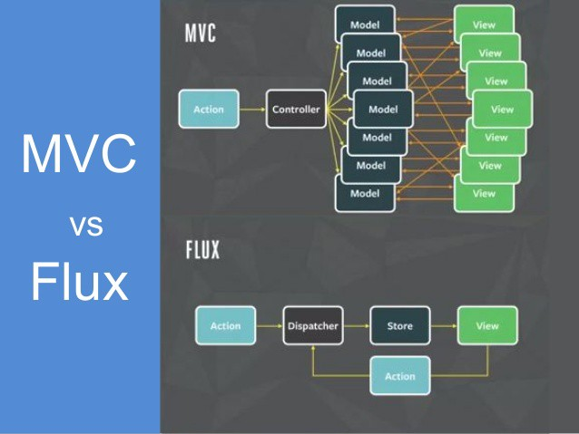
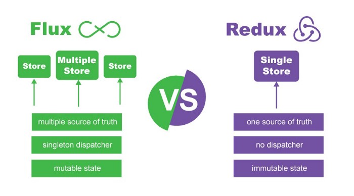
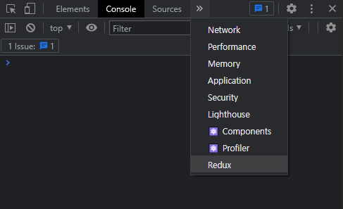
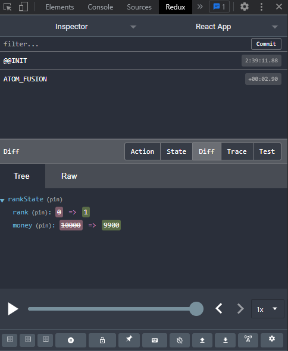

# Redux
  
`Context API` 등장 이전, 컴포넌트 간에 데이터 전달은 상당히 복잡했고 이를 개선하기 위해 `Context API`가 등장하게 됐습니다. `Redux`는 `Context API`의 전역 데이터를 쉽게 다루기 위해 만들어진 라이브러리입니다.

  
`Redux`는 `Flux`구조에서 영감을 받아 만들어졌다. 하지만 `Flux`와는 달리 단 하나의 `Store`를 가지고 있고, 불변적인 특성이 있으며, `dispatcher`를 가지고 있지 않습니다. 단 `react-redux`에서는 `dispatch()`를 통해 `Store`를 제어하는데, 이는 react의 특성으로 인한 것입니다.



## 개요
```
npm install redux react-redux
```
react에서 redux를 실행시키기 위해선 라이브러리를 설치해야합니다.

### Action
```javascript
action = {
    type: 'PRINT_HELLO'
} // payload가 없는 Action

action = {
    type: 'PRINT',
    payload: 'Hello World!!!'
} // payload가 있는 Action
```
Action은 객체로, Store에 전달되어 Store의 상태를 변경하는데에 사용됩니다.

### Action Creator
```javascript
export const PRINT_HELLO = "PRINT_HELLO";
export function printHello() {
    return {
        type: PRINT_HELLO
    }
}

export const PRINT = "PRINT";
export function print(payload) {
    return {
        type: PRINT,
        payload
    }
}
```
Action 생성자는 Action을 생성하는 함수입니다. 함수를 통해 액션을 생성 후 액션 객체를 리턴합니다. 이렇게 생성된 Actiont 생성자는 `dispatch()`를 통해 호출 할 수 있습니다. payload를 인자로 받아 액션으로 만들어 return 해줍니다.

```javascript
import { useDispatch } from 'react-redux';

function App() {
    const dispatch = useDispatch();

    const click = useCallback(_ => {
        dispatch(printHello());
    }, [dispatch]);

    return (
        <button onclick={click}>print hello</button>
    )
}
```

### Reducer
```javascript
// print.js
const initialState = 'Hello World!!!';

export default function print(previousState=initialState, action) {
    if(action.type === PRINT_HELLO) {
        return 'Hello World!!!';
    }

    if(action.type === PRINT) {
        return action.payload;
    }

    return previousState;
}
```
print의 상태를 관리하는 reducer는 위와 같은 형태를 하고 있습니다.

```javascript
// reducer.js
import {combineReducers} from 'redux';

const reducer = combineReducers({
    print, filter, ...etc
});

export default reducer;
```
생성된 print의 리듀서는 combineReducers로 묶어서 하나의 Store로 만듭니다. 리덕스는 하나의 스토어만 존재할 수 있기 때문입니다.

### Store
```javascript
// store.js
import { createStore } from 'redux';
import { reducer } from './reducer/reducer';

const store = createStore(reducer);
export default store;
```
리듀서를 store에 포함시켜 전역에서 사용할 redux의 store를 만듭니다.

```javascript
// index.js
import { Provider } from "react-redux";
import { store } from './redux/store';

ReactDOM.render(
    <Provider store={store}>
        <App />
    </Provider>,
    document.getElementById('root')
);
```
생성된 스토어는 Provider를 통해 전역에서 사용할 수 있습니다.

## Ducks Pattern
[Ducks Pattern 공식문서](https://github.com/JisuPark/ducks-modular-redux)  
Redux의 Ducks Pattern은 라이브러리나 번들이 아닌 디자인 패턴입니다. 모듈화 및 코드 관리가 기존에 비해 용이해지기 때문에 많이 사용하는 디자인 패턴입니다.
```
src
- App.js
- index.js
- /redux
  - store.js
  - actions.js
  - /reducers
    - print.js
    - reducer.js
```
현재는 위와 같은 파일 구조를 가지고 있습니다. 여기서 리듀서와 액션이 추가될 수록 actions는 점점 비대해지고, 관리하기 어려워 질 겁니다. 이를 편리하게 하기위해 Ducks Pattern을 사용합니다.

```
src
- App.js
- index.js
- /redux
  - store.js
  - /modules
    - print.js
    - reducer.js
```
위에서 actions.js가 사라지고 reducer 디렉토리의 이름이 modules로 변경되었습니다. 하지만 변화는 이것 뿐만이 아닙니다.

```javascript
// print.js
const PRINT_HELLO = "ex_redux/print/PRINT_HELLO";
export function printHello() {
	return {
		type: PRINT_HELLO
	}
}

const PRINT = "ex_redux/print/PRINT";
export function print(payload) {
	return {
		type: PRINT,
		payload
	}
}

const initialState = 'Hello World!!!';

export default function reducer(previousState=initialState, action) {
	if(action.type === PRINT_HELLO) {
		return 'Hello World!!!';
	}

	if(action.type === PRINT) {
		return action.payload;
	}

	return previousState;
}
```
리듀서만 정의되어있던 print.js에 기존의 actions.js에 있던 코드가 옮겨졌습니다. 이렇게 되면 print 상태를 print.js 파일 하나를 통해 모듈화 할 수 있다는 장점을 가집니다. action type은 `projectName/reducerName/type`의 형태로 작성합니다.

```
1. 항상 reducer()란 이름의 함수를 export default 해야합니다.
2. 항상 모듈의 action 생성자들을 함수형태로 export 해야합니다.
3. 항상 `npm-module-or-app/reducer/ACTION_TYPE` 형태의 action 타입을 가져야합니다.
3. 어쩌면 action 타입들을 UPPER_SNAKE_CASE로 export 할 수 있습니다. 
   만약, 외부 reducer가 해당 action들이 발생하는지 계속 기다리거나, 재사용할 수 있는 라이브러리로 퍼블리싱할 경우에 말이죠.
```
위 공식문서에서 제공하는 Ducks Pattern의 규칙입니다.

## redux-actions
```
npm install redux-actions
```
redux-actions는 redux의 ducks pattern을 좀 더 쉽게 사용하기 위해 만든 라이브러리입니다.

```javascript
import { createActions } from "redux-actions";

export const { print, printHello } = createActions("PRINT", "PRINT_HELLO", { prefix: 'ex_redux/print' });

const initialState = 'Hello World!!!';

const reducer = handleActions(
    {
        PRINT: () => "Hello World!!!",
        PRINT_HELLO: (state, action) => action.payload,
    },
    initialState,
    { prefix: 'ex_redux/print' }
)

export default reducer;
```
redux-actions로 인해 좀 더 쉽게 ducks pattern 을 구현할 수 있게 되었습니다.

## redux-devTools
[redux-devTools 크롬 확장프로그램](https://chrome.google.com/webstore/detail/redux-devtools/lmhkpmbekcpmknklioeibfkpmmfibljd?hl=ko) 을 설치해줍니다.

```
npm install redux-devtools-extension
```
`redux-devtools-extension`를 설치해줍니다.

```javascript
// store.js
import { composeWithDevTools } from "redux-devtools-extension";

const store = createStore(reducer, composeWithDevTools(applyMiddleware()));
export default store;
```
`composeWithDevTools(applyMiddleware())` 구문을 `createStore`의 인자로 추가합니다.

  
Redux가 추가된 것을 확인 할 수 있습니다.

  
Redux의 동작 상황을 확인 할 수 있습니다.

## 더 알아보기
- redux-middleware
- redux-thunk
- function*
- redux-saga
