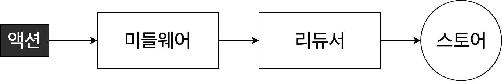

# Redux-Middleware
  
리덕스 미들웨어는 액션을 디스패치했을 때, 리듀서에서 이를 처리하기 전에 설정된 작업을 실행하도록 도와줍니다. 액션과 리듀서의 사이에 있는 중간자라 볼 수 있습니다. 액션을 콘솔에 남기거나, 액션을 취소 및 추가, 변형 하는 등 다양한 역할을 수행할 수 있습니다. 주로 리덕스에서 비동기 작업을 실행할 때 사용합니다. 주요 라이브러리로는 [redux-thunk](https://github.com/reduxjs/redux-thunk), [redux-observable](https://redux-observable.js.org/), [redux-promise-middleware](https://github.com/pburtchaell/redux-promise-middleware), [redux-saga](https://redux-saga.js.org/) 가 있습니다.

## Redux Middleware의 구조
```javascript
import { applyMiddleware, createStore } from 'redux';
import reducer from './reducers/reducer';

function actionLogger(store) { // middleware는 store를 인자로 받는다
  return (next) => { // next는 다음 middleware를 가리킨다
    return (action) => { // dispatch 된 action을 인자로 받는다
      /* 이 middleware에서 수행할 동작 */ 
      console.log('입력받은 Action : ', action);

      // 다음 middleware인 next에게 action을 넘겨준다
      // 이 미들웨어가 마지막 미들웨어면 action을 reducer에게 전달하며 실제로 dispatch 된다
      return next(action); 
    }
  }
} 
// function middleware store => next => action => next(action) 

const store = createStore(reducer, applyMiddleware(actionLogger)); 
// createStore의 2번째 인자는 enhancement로 미들웨어를 인자로 받는다
// applyMiddleware 함수에 넣어서 인자로 포함시킨다
// 여러 미들웨어를 포함시킬 경우 applyMiddleware(mw1, mw2, mw3, ...); 

export default store;
```
`action`이 `dispatch` 되는 경우 해당 액션을 로그로 출력하는 미들웨어를 작성했습니다. 미들웨어는 함수의 형태를 하고 있습니다. `applyMiddleware`에 입력된 순서대로 실행되며, 처음 호출된 미들웨어가 `return`할 때, `action`이 `reducer`에게 넘어가며 실제로 `dispatch`됩니다.

## Redux Middleware가 필요한 이유
```javascript
// src/containers/Container_non.js
export default function UserListContainer() {
  const users = useSelector(state => state.users_none.data);
  const dispatch = useDispatch();
  const getUsers = useCallback(async() => {
    try {
      dispatch(getUsersStart());
      const res = await axios.get('https://api.github.com/users'); // component에서 외부함수를 호출
      dispatch(getUsersSuccess(res.data));
    } catch (error) {
      dispatch(getUsersFail(error));
    }
  }, [dispatch]);

  return <List users={users} getUsers={getUsers} />
}
```
`redux middleware`를 사용하지 않으면 비동기 로직을 컴포넌트에서 사용해야하는 문제가 있습니다. 왜냐하면 `redux`는 불변성과 순수함수의 규칙을 지켜야 동작하기 때문입니다. 외부의 비동기 로직을 사용하는 경우 순수함수가 훼손되고 불변성이 지켜지지 않아, `redux`가 정상적으로 동작하지 않습니다.

## Redux Thunk
이러한 비동기 작업을 처리하기 위해 개발한 것이 `redux-thunk` 라이브러리입니다. 여기서 `thunk`란 특정 작업을 나중에 하도록 미루기 위해 함수형태로 감싼 것을 지칭합니다.
```javascript
const x = 1 + 2; // 특정 작업

const foo = () => 1 + 2; // thunk
```
이 경우 `foo()`가 호출될 때까지 연산 작업이 미루어집니다.

```javascript
function createThunkMiddleware(extraArgument) {
  return ({ dispatch, getState }) => (next) => (action) => {
    if(typeof action === 'function') {
      return action(dispatch, getState, extraArgument);
    }

    return next(action);
  };
}
```
이것은 `redux-thunk`의 미들웨어입니다. `store`의 `dispatch`와 `getstate`를 전달받아 함수로 전달받은 `action`을 수행 후 다음 미들웨어를 실행하는 간단한 로직으로 이루어져 있습니다.

```javascript
// src/redux/modules/users.js
export function getUserThunk(dispatch) {
  return async (dispatch) => {
    try {
      dispatch(getUsersStart());
      await sleep(2000);
      const res = await axios.get('https://api.github.com/users');
      dispatch(getUsersSuccess(res.data));
    } catch (error) {
      dispatch(getUsersFail(error));
    }
  }
}
```
`thunk`함수를 만들어줍니다. 기존의 `redux`에선 `state`를 `return`해주었지만, `thunk`함수는 함수를 `return`해줍니다. 위에서 본 `thunk`함수의 로직에 따라 인자가 `function`이면 `thunk`미들웨어를 실행하는데, 이 때문에 `getUserThunk()`는 `thunk`미들웨어에서 동작하게 됩니다.

```javascript
// src/containers/Container_promise.js
export default function Container_promise() {
  const users = useSelector(state => state.users.data);
  const dispatch = useDispatch();
  const getUsers = useCallback(() => {
    dispatch(getUserThunk());
  }, [dispatch]);

  return <List users={users} getUsers={getUsers} />
}
```
실제 컴포넌트에선 `getUserThunk()`만 실행하면 되기에, 컴포넌트와 크게 관련이 없는 데이터를 읽어오는 로직이 `thunk`함수로 이동하게 되어 코드의 양이 줄어들게 됩니다.

```javascript
import {applyMiddleware, createStore} from "redux";
import reducer from "./modules/reducer";
import thunk from "redux-thunk";

const store = createStore(reducer, applyMiddleware(thunk));

export default store;
```
`redux`의 공식문서에 따르면 여러 미들웨어를 사용할 때 비동기 로직이 구현된 미들웨어의 경우, 다른 미들웨어보다 먼저 사용할 것을 권장하고 있습니다. 예를 들어, `redux-logger`와 `redux-thunk`를 사용할 경우, `applyMiddleware(thunk, logger);`로 작성하여 비동기 로직인 thunk를 먼저 사용해야 합니다.


## Redux Promise Middleware
`redux-promise-middleware`는 요청이 시작, 성공, 실패 할 때 액션 타입에 _PENDING, _FULFILLED, _REJECTED를 반환하는 라이브러리입니다. 그리고 액션 함수에서 수행한 `promise`의 결과값은 `payload` 속성으로 반환됩니다.

```javascript
// src/redux/modules/users.js
export function getUsersPromise() {
  return {
    type: GET_USERS,
    payload: async () => {
      await sleep(2000);
      const res = await axios.get('https://api.github.com/users');
      return res.data;
    }
  }
}
```
`redux-promise-middleware`의 액션 함수입니다. `redux-thunk`와 달리 함수를 직접 리턴하는 것이 아닌, 기존의 `redux`와 마찬가지로 `action`를 리턴하지만 `payload`로 `Promise`를 넣는 것이 특징입니다. 이렇게 작성된 액션은 미들웨어에서 `Promise`를 수행한 후 결과값을 `payload`로 반환합니다.

```javascript
export default function reducer(state=initialState, action) {
  if(action.type === GET_USERS_PENDING) {
    return { ...state, loading: true, data: [], error: null };
  }

  if(action.type === GET_USERS_FULFILLED) {
    return { ...state, loading: false, data: action.payload }
  }

  if(action.type === GET_USERS_REJECTED) {
    return { ...state, loading: false, error: action.payload }
  }

  return state;
}
```
위에서 언급한대로 `action.type`에 `_PENDING`과 `_FULFILLED`, `_REJECTED`를 붙여서 반환하기 때문에 이에 대한 리듀서를 작성해주어야 합니다.

```javascript
export default function Container_promise() {
  const users = useSelector(state => state.users.data);
  const dispatch = useDispatch();
  const getUsers = useCallback(() => {
    dispatch(getUsersPromise());
  }, [dispatch]);

  return <List users={users} getUsers={getUsers} />
}
```
사용시엔 thunk와 동일하게 사용할 수 있습니다. thunk는 액션 생성 함수에서 예외처리를 모두 해야하지만, promise는 리듀서에서 예외처리를 할 수 있다는 차이점이 있습니다.

## 참고자료
- [미들웨어 만들어보고 이해하기](https://react.vlpt.us/redux-middleware/02-make-middleware.html)
- [redux-thunk Git](https://github.com/reduxjs/redux-thunk)
- [redux-thunk · GitBook - 벨로퍼트와 함께하는 모던 리액트](https://react.vlpt.us/redux-middleware/04-redux-thunk.html)
- [redux-thunk - 리덕스 미들웨어와 외부 데이터 연동](https://redux-advanced.vlpt.us/2/01.html)
- [redux-promise-middleware](https://redux-advanced.vlpt.us/2/03.html)
- [미들웨어란? (Redux Thunk, redux-promise-middleware)](https://tried.tistory.com/86)
