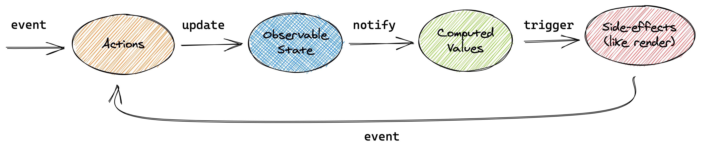

# MobX
`MobX`는 `Redux`처럼 상태를 관리하는 라이브러리입니다. 이들과 차별화되는 점으로는 다음과 같습니다.
1. `Flux` 패턴을 사용하는 `Redux`와 달리 `Observer` 패턴을 사용합니다.
2. `Decorator`를 적극 활용
3. TypeScript가 Base인 라이브러리
4. `Redux`와 다르게 단일 스토어를 강제하지 않음

  
액션이 발생하면 `Observable State`가 업데이트 되고, `Computed Values`에 전달해 변경사항이 있으면 `Side-effects`를 일으킵니다. 이것이 MobX의 기본 흐름입니다.

## Decorator 설정
### Javascript
```
npx create-react-app mobx-start
cd mobx-start
npm i customize-cra react-app-rewired -D
```
`customize-cra`와 `react-app-rewired`는 react를 eject 하지 않고도 MobX를 설치하고 설정할 수 있습니다.

```javascript
// config-override.js
const { override, addDecoratorsLegacy } = require('customize-cra');
module.exports = override(addDecoratorsLegacy());
```
package.json가 있는 폴더에 config-override.js를 위와 같이 작성하면, 자바스크립트에서 `Decorator`를 사용할 수 있습니다.

```
// package.json
{
  "scripts": {
    "start": "react-app-rewired start",
    "build": "react-app-rewired build",
    "test": "react-app-rewired test",
    "eject": "react-scripts eject"
  }
}
```  
package.json에서 react-scripts 대신 react-app-rewired를 사용하도록 변경한다. 다만 eject는 react-script로 남겨둡니다.

```
npm i autobind-decorator
```
this를 자동으로 bind 해주는 autobind-decorator를 설치해준다.

```
// jsconfig.json
{
  "compilerOptions": {
    "experimentalDecorators": true
  }
}
```
package.json과 같은 폴더에 jsconfig.json을 위와 같이 작성하고, node를 재실행하면 autobind가 정상적으로 동작합니다.

`Javascript`를 사용하는 경우 Decorator 설정이 복잡하기 때문에 `Typescript`에서 사용하는 것을 권장합니다.

### Typescript
```
npx create-react-app mobx-ts-start --template typescript
cd mobx-ts-start
npm i autobind-decorator
```
```
// tsconfig.json
{
  ...
  "compilerOptions": {
    ...
    "experimentalDecorators": true
  }
}
```
javascript에 비해 typescript의 설치 및 설정은 간단합니다.

## Decorator
```typescript jsx
export default class Button extends React.Component {
  render() {
    return <button onClick={this.click}>클릭</button>;
  }
  
  @autobind
  click() {
    console.log("clicked");
  }
}
```
데코레이터란 @로 표시되는 함수를 의미합니다. Javascript와 Typescript에서 Decorator 사용은 크게 차이가 나지 않습니다. `@autobind`는 `this`를 자동으로 바인드해주는 데코레이터로, `this`가 잘못 지정되는 오류를 차단해줍니다.

## Observable
```shell
npm i mobx
```
`Observable`은 상태로써, 관측 가능한 상태를 의미합니다. Observable로 지정된 상태는 변화가 있으면 MobX에게 변화를 알려줍니다. MobX에서 Observable이 변화하면 reaction과 computations를 일으킵니다.

```javascript
import { autorun, observable } from "mobx";
const person = observable({
  name: 'Dawson', age: 32,
})

autorun(() => {
  console.log(person.name);
  console.log(person.age);
});

person.age = 22;

/* 결과 */
// Dawson
// 32
// Dawson
// 22
```
위처럼 함수로 사용하는 방식은 데코레이터를 사용하지 않고 사용하며, 리턴한 객체를 사용하는 방식입니다. 리덕스와 달리 값을 `mutable`하게 변경할 수 있습니다.

```javascript
import { autorun, observable, makeObservable } from "mobx";
class PersonStore {
  @observable name = "Mark";
  @observable age = 39;

  constructor() { makeObservable(this); }
}

const personStore = new PersonStore();
autorun(() => { console.log(personStore.age); });
personStore.age = 49;

/* 결과 */
// 39
// 49
```
위는 클래스를 사용하는 방식으로 데코레이터를 사용해, 값을 추적 관리하는 방식입니다. 함수형과 마찬가지로 `mutable`한 특성을 가지고 있습니다.

## Observer
```shell
npm i mobx-react
```
`Observer`는 `Observable`한 상태가 변경되었을 때, `Observer`로 지정된 컴포넌트들이 다시 렌더링하게 만드는 메소드입니다. 여기서는 함수형 컴포넌트를 `Observer` 처리하는 방법에 대해서만 다루겠습니다.

```typescript
// contexts/PersonContext.ts
const PersonContext = createContext<any>(undefined);
export default PersonContext;
```
Observable을 전역적으로 사용할 수 있도록 Context를 만들어줍니다.

```typescript jsx
// index.tsx
const personStore = new PersonStore();

ReactDOM.render(
  <React.StrictMode>
    <PersonContext.Provider value={personStore}>
      <App />
    </PersonContext.Provider>
  </React.StrictMode>,
  document.getElementById('root')
);
```
index.tsx에서 Context를 포함시켜줍니다.

```typescript
// stores/PersonStore.ts
export default class PersonStore {
  @observable name = "Mark";
  @observable age = 39;

  constructor() { makeObservable(this); }
  plus() { this.age++ }
}
```
Component에서 사용할 MobX Store를 선언해줍니다.

```typescript jsx
// App.tsx
function App() {
  const personStore = useContext(PersonContext);

  return (
    <div className="App">
      <p>{personStore.age}</p>
      <p><button onClick={click}>PLUS</button></p>
    </div>
  );

  function click() { personStore.plus(); }
}

export default observer(App);
```
함수형 컴포넌트에선 `export default` 할 때 함수형 컴포넌트를 `observer()`로 감싸서 export 해주면 `observable`이 변경되면 감지해서 컴포넌트를 리렌더링 해줍니다.

## Computed
`Computed`는 `Observable State`를 가공하는 단계입니다. 사용시 이점으로는, 사용자가 직접 `Observable`을 관리할 때는 렌더링이 빈번하게 일어나지만, `Computed`에 의해서 값이 변경되었을 때만 렌더링이 일어나므로 자원관리에 좀 더 효과적입니다.

```typescript jsx
// stores/PersonStore.ts
export default class PersonStore {
  @computed
  get age10() {
    return Math.floor(this.age / 10) * 10;
  }
}
```
`Observable class`에서 `getter`에만 `@computed`를 사용할 수 있습니다. 위 `getter`는 10의 자리마다 렌더링이 일어나도록 하는 `computed` 입니다.

```typescript jsx
// App.tsx
function App() {
  console.log("render");

  return (
    <p>{personStore.age10}</p>
  )
}
```
App 컴포넌트에서 실행해보면, 10의 자리가 될 때마다 렌더링이 일어난다는 것을 알 수 있습니다.

```typescript jsx
// App.tsx
function App() {
  const age10 = computed(() => {
    return Math.floor(personStore.age / 10) * 10;
  }).get();

  console.log("render");

  return (
    <p>{age10}</p>
  )
}

export default observer(App);
```
함수형 컴포넌트에선 `computed()` 메소드에 인자로, `return` 값을 가지는 함수와 `get()` 메소드를 붙여서 사용할 수 있습니다. 물론 `export default`에서 `observer()`로 감싸주어 `Observable State`의 값의 변경을 감지할 수 있도록 해줍니다.

## Action
Action은 Observable State를 update 시키는 요인이 됩니다. 이 점은 Redux의 Action과도 상통하는 면이 있습니다. 하나의 Action엔 한 번의 렌더링이 되도록하여, Observable State가 변경될 때마다 불필요하게 렌더링이 되지 않도록 조절할 수 있습니다.

```typescript jsx
// App.tsx
function App() {
  console.log("render", personStore.age, personStore.name);

  function click() {
    setTimeout(action(() => {
      personStore.age = 45;
      personStore.name = 'Hero';
    }), 500)
  }
}
```
다음은 click()이 실행됐을 때, `age`와 `name`을 변경하는 로직입니다. 이 때 `console.log`를 출력하면 **age가 변경될 때** + **name이 변경될 때** 각각 1번씩 호출되어, 렌더링이 2번 되는 것을 알 수 있습니다. 만약 `Observable State` 5개가 변경된다면 하나의 액션에서 5번의 렌더링이 발생하는 문제를 겪을 수 있습니다.

```typescript jsx
// App.tsx
function App() {
  console.log("render", personStore.age, personStore.name);

  function click() {
    // setTimeout(action(() => {
    //   personStore.age = 45;
    //   personStore.name = 'Hero';
    // }), 500)

    setTimeout(() => {
      runInAction(() => {
        personStore.age = 45;
        personStore.name = 'Hero';
      })
    }, 500)
  }
}
```
이를 action으로 처리하면 State가 2개 변경되어도, 렌더링은 1번만 일어나는 것을 확인할 수 있습니다. Hooks에선 `action`으로 구현된 부분을 감싸주면 됩니다. 다만 `action()` 메소드는 함수를 반환하는 메소드기 때문에, 따로 실행하는 구문을 추가해줘야 합니다. 이를 간소화한 `runInAction()` 메소드를 이용해, 함수를 생성하고 실행시킬 수 있습니다.

```typescript jsx
// store/PersonStore.ts
export default class PersonStore {
  @action
  testAction() {
    this.age = 45;
    this.name = "Hero";
  }
}
```
`Store`에서 `Action`을 정의하는 경우, 메소드 위에 `@action` 데코레이터를 달아주면 됩니다.

```typescript jsx
// App.tsx
function App() {
  console.log("render", personStore.age, personStore.name);

  function click() {
    setTimeout(() => {
      personStore.testAction();
    }, 500)
  }
}
```
`Store`에 정의된 `action`은 위처럼 접근할 수 있습니다. 만약 `Store`에서 `action`을 사용할 때, `action` 데코레이터를 사용하지 않는다면 `Warning`이 발생하기에 디버깅하기에 용이하다는 점도 있습니다.

## Inject & Provider
`Provider`는 `Context`의 `Provider`처럼 컴포넌트로 `MobX Store`를 넘겨주는 컴포넌트입니다.  
`Inject`는 컴포넌트에서 스토어에 접근할 수 있도록 하는 메소드이자 데코레이터입니다.

```typescript jsx
// index.tsx
import { Provider } from "mobx-react";
import App from "./App";

const personStore = new PersonStore()

ReactDOM.render(
  <React.StrictMode>
    <Provider personStore={ personStore }>
      <App />
    </Provider>
  </React.StrictMode>,
  document.getElementById('root')
);
```
기존에는 `useContext`를 이용해 `Custom Provider`를 작성했지만, `mobx-react`의 `Provider` 컴포넌트를 불러와 사용합니다. `Provider`의 인자로 작성한 `personStore`를 넘겨줍니다.

```typescript jsx
// App.tsx
function App(Props:any) {
  const { personStore } = Props;

  return (
    <div className="App">
      <header className="App-header">
        <p>{personStore.name}, {personStore.age}</p>
        <p><button onClick={click}>PLUS</button></p>
      </header>
    </div>
  );

  function click() {
    personStore.plus();
  }
}

export default inject('personStore')(observer(App));
```
`App` 컴포넌트에서 `inject()` 메소드에 인자로 `'personStore'`를 넘겨주면, `Provider`에 할당된 `personStore`에 접근할 수 있습니다. Provider에서 넘겨받은 `store`는 Prop으로 접근할 수 있습니다. 단, 이렇게 될 경우 컴포넌트와 상관없는 store에 접근하는 로직이 추가됩니다.

```typescript jsx
// App.tsx
function AppContainer(Props:any) {
  const { personStore } = Props
  const plus = () => { personStore.plus(); }

  return <App plus={plus} age10={personStore.age10} />
}

export default inject('personStore')(observer(AppContainer));
```
`MobX`를 분리시키기 위해 `AppContainer`컴포넌트를 작성합니다. `AppContainer`는 `personStore`를 `Provider`로부터 받아와야하기 때문에 `export default`로 `AppContainer`를 `inject`로 감싸서 내보내줍니다.

```typescript jsx
// App.tsx
function App({ plus, age10 }:{ plus:any, age10:any }) {
  return (
    <div className="App">
      <header className="App-header">
        <p>{ age10 }</p>
        <p><button onClick={ click }>PLUS</button></p>
      </header>
    </div>
  );

  function click() { plus(); }
}
```
`personStore`의 `action`이나 `computed`를 `props`로 전달받습니다. 이렇게 사용하면, `MobX`를 가져오는 부분과 보여지는 부분을 구별할 수 있어서 코드관리에 용이해집니다.


## 참고자료
- [MobX Official Site](https://mobx.js.org/README.html)
- [데코레이터](https://typescript-kr.github.io/pages/decorators.html)
- [옵서버 패턴](https://ko.wikipedia.org/wiki/%EC%98%B5%EC%84%9C%EB%B2%84_%ED%8C%A8%ED%84%B4)
- [React에서 MobX 경험기 (Redux와 비교기)](https://techblog.woowahan.com/2599/)
- [MobX 알아보기](https://kyounghwan01.github.io/blog/React/mobx/basic/#%E1%84%89%E1%85%A1%E1%84%8B%E1%85%AD%E1%86%BC%E1%84%92%E1%85%A1%E1%84%82%E1%85%B3%E1%86%AB-%E1%84%8B%E1%85%B5%E1%84%8B%E1%85%B2)
- [리액트 프로젝트에서 MobX 사용하기](https://velog.io/@velopert/MobX-2-%EB%A6%AC%EC%95%A1%ED%8A%B8-%ED%94%84%EB%A1%9C%EC%A0%9D%ED%8A%B8%EC%97%90%EC%84%9C-MobX-%EC%82%AC%EC%9A%A9%ED%95%98%EA%B8%B0-oejltas52z)
